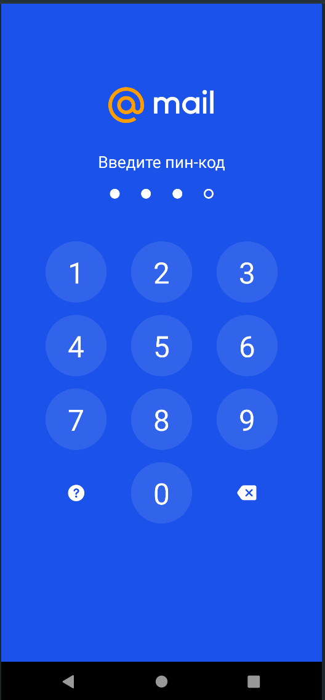

# Vezdekod Mobile 2022 Томск/Иркутск 
## Doll Blues Vachello
---

### Приложение для _Android_ устройств 

# Структура приложения:

- Окно входа
- - При первом запуске пользователю будет предложено создать новый пароль
- - При каждом последующем запуске, пользователю будет нужно ввести пароль созданный заранее

- Окно со сторисами
- - В первоначальном виде приложения доступно 5 историй с достопримечательностями из разных городов России
- - Переключение между историями происходит после нажатия на левую и правую части истории
- - При нажатии на кнопку подробнее будет открыта статья о достопримечательности в википедии в браузере по умолчанию

# Технологический стек:
- Kotlin
- Jetpack Compose
- Glide
- Multimodule Architecture

# Системные требования: 
## Минимальные: 
- Android 5.0

## Рекомендованные (на которых проводилось тестирование):
- Android 12.0

# Скриншоты:

